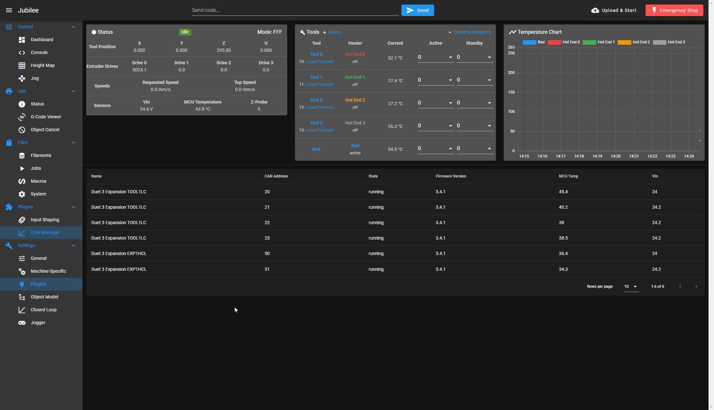
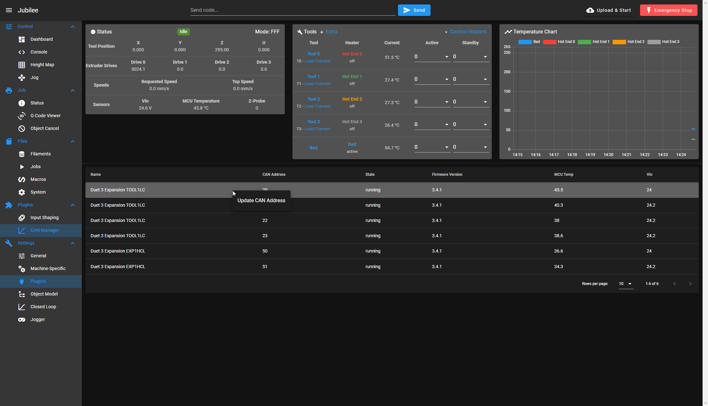

# DWC-CAN-Manager
DWC CAN Manager Plugin

This plugin provides a list of information about CAN devices that are currently configured on the Duet.

Currently this plugin also allows you to right click and change a CAN address. Restart of the Duet is required after changing the address.

